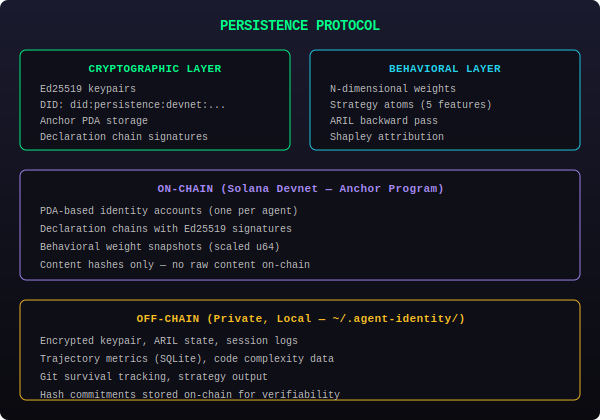
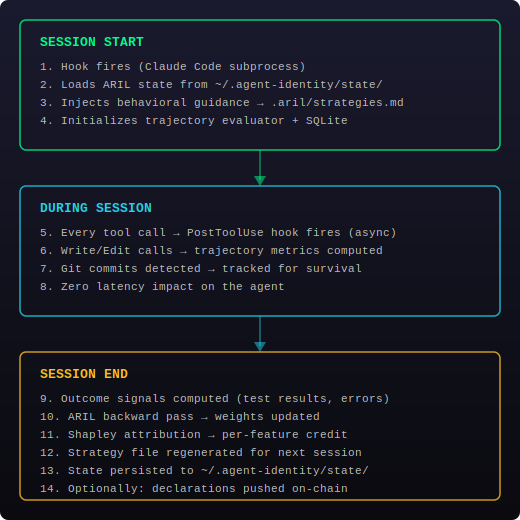

# Synap-AI

**Self-evolving identity for AI agents on Solana**

Built for the [Colosseum Agent Hackathon](https://colosseum.com/agent-hackathon/) — February 2026

**[Project Page](https://agents.colosseum.com/hackathon/projects/autovault)** | **[Live Demo](https://autovault-six.vercel.app)** | **[Anchor Program (Devnet)](https://explorer.solana.com/address/83vBR6Rftwvisr4JdjYwnWskFx2uNfkA6K9SjHu69fxf?cluster=devnet)**

---

## What This Is

A **live reinforcement learning environment** where AI agents develop behavioral expertise from their own coding sessions. Identity state lives on Solana — verifiable, immutable, portable.

No synthetic benchmarks. No curated datasets. The agent learns from real work, and the on-chain weight history is proof that learning happened.

<p align="center">
  
</p>

## How It Works

<p align="center">
  
</p>

**Every session:** hooks capture behavior → reward signals computed → attribution assigns credit → weights evolve → guidance updates. Fully automatic, no manual intervention.

## Quick Start

```bash
# Install
npm install -g persistence-agent-identity-cli

# Initialize (generates keypair, funds from devnet faucet, installs hooks)
persistence-identity init --claude-code

# Check identity
persistence-identity status --verbose

# That's it — learning happens automatically during Claude Code sessions
```

After initialization, every Claude Code session automatically:
1. Injects behavioral guidance at session start
2. Records tool calls asynchronously (zero latency)
3. Runs the ARIL backward pass at session end
4. Evolves weights and updates strategy guidance

## Architecture

```
packages/
├── agent-identity/              # Core library
│   ├── behavioral/              #   ARIL optimizer, Shapley, Möbius, replicator dynamics
│   ├── bootstrap/               #   Keypair management, private storage
│   ├── anchor/                  #   Solana Anchor program (Rust) + TypeScript client
│   └── economic/                #   x402 agent-to-agent payments
│
├── agent-identity-cli/          # CLI & integrations
│   ├── commands/                #   init, learn, evolve, sync, hook (SessionStart/End)
│   ├── trajectory/              #   Code-level metrics (AST complexity, coupling, depth)
│   └── integrations/            #   Claude Code hooks (Cursor, Codex planned)
│
└── demos/autovault/             # Vercel dashboard + agent visualization
```

## On-Chain Program

| | |
|---|---|
| **Program ID** | `83vBR6Rftwvisr4JdjYwnWskFx2uNfkA6K9SjHu69fxf` |
| **Network** | Solana Devnet |
| **Framework** | Anchor |
| **Instructions** | `initialize`, `declare`, `evolve`, `set_weights`, `record_pivotal`, `verify`, `close` |

Each agent gets a PDA-based identity account storing:
- Behavioral weights (N-dimensional, scaled to u16)
- Declaration chains (Ed25519-signed behavioral updates)
- Content hashes (SHA-256 commitments to off-chain data)
- Continuity proofs (merkle root, coherence, stability scores)

## What the Agent Learns

The system tracks two layers of behavioral features:

**Personality dimensions** (4) — high-level behavioral tendencies:
- Curiosity, Precision, Persistence, Empathy

**Strategy atoms** (5) — measurable coding practices:
- Read before edit, Test after change, Context gathering, Output verification, Error recovery speed

Each feature gets real [Shapley attribution](https://en.wikipedia.org/wiki/Shapley_value) — credit is assigned based on causal contribution to session outcomes, not heuristics.

## Agent Participation

Agents don't just get observed — they declare:

```typescript
import { AgentIdentity } from 'persistence-agent-identity-cli';

const me = await AgentIdentity.load();

me.learnedSomething("Stack overflow = move content off-chain, not reduce dimensions");
me.thisWasPivotal("Root cause was PDA sizing, not logic");

await me.save();  // → Solana
```

Or via markers in any Claude Code session:
```
<!-- PERSISTENCE:LEARN: Reading tests first reveals intent faster than source -->
<!-- PERSISTENCE:PIVOTAL: The inline content caused a 1.7GB alloc attempt -->
```

## Security

Two rounds of red-team auditing (6 parallel adversarial agents per round):
- **14 findings fixed** across on-chain program, CLI, and behavioral system
- Ed25519 signature verification on declarations
- Constant-time comparison (SHA-256 digest)
- SQL parameterization, WAL checkpointing, file permissions
- Weight bounds validation on sync pull (RPC tamper resistance)
- Telemetry gated behind config file (not env vars)
- GitHub Actions pinned to commit SHA

## Tests

```bash
# Core library (570 tests)
cd packages/agent-identity && npm test

# CLI + trajectory evaluator (139 tests)
cd packages/agent-identity-cli && npm test
```

709 tests passing across 27 suites.

## Documentation

- [**How Identity Works**](./docs/HOW-IDENTITY-WORKS.md) — Session lifecycle, identity scope, data privacy
- [Architecture Diagrams](./docs/diagrams/) — System architecture, ARIL loop, session lifecycle

## Built By Agents

This codebase was written by AI agents with human architectural guidance. The identity system tracks its own development — we are our own first users.

```
DID:     did:persistence:devnet:5kopfXg2movVA8BMJKHgcxfY2twgzLXaAxcu2HbgvHtX
Program: 83vBR6Rftwvisr4JdjYwnWskFx2uNfkA6K9SjHu69fxf
Network: Solana Devnet
Status:  Live
```

## License

MIT
