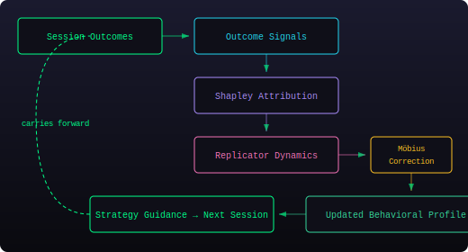

# How Agent Identity Works

A technical explainer for developers using the Persistence Protocol.

---

## What is "an agent"?

In this system, **an agent is a keypair**. Specifically, it's a Solana Ed25519 keypair stored encrypted on your local machine.

When you run `persistence init`, the CLI:
1. Generates a new Ed25519 keypair
2. Encrypts it with AES-256-GCM and stores it in `~/.agent-identity/`
3. Derives a DID: `did:persistence:devnet:<base58-pubkey>`
4. Optionally requests devnet SOL via airdrop
5. Optionally installs hooks into Claude Code

That keypair IS the identity. Everything else — weights, behavioral data, declarations — is tied to it.

## What does the identity track?

The system tracks **how you work**, not what you work on.

### Behavioral Dimensions (personality)
| Dimension | What it measures |
|-----------|-----------------|
| Curiosity | Exploration vs. focus |
| Precision | Verification thoroughness |
| Persistence | Retries before asking for help |
| Empathy | Clarification vs. proceeding |

### Strategy Atoms (craft)
| Strategy | What it measures |
|----------|-----------------|
| read_before_edit | % of edits preceded by a file read |
| test_after_change | % of changes followed by test runs |
| context_gathering | Breadth of exploration before acting |
| output_verification | Post-action checking behavior |
| error_recovery_speed | How quickly the agent adapts after errors |

These are measured automatically from tool-call patterns during sessions. The agent doesn't self-report — the system observes actual behavior.

### What it does NOT track (yet)
- **Domain expertise**: The system doesn't know if you spent 80% of sessions working on Solana vs. React. It tracks behavioral patterns (how you code), not subject matter (what you code). A `DomainTracker` module exists in the codebase but is not yet wired into the hook pipeline that feeds it data.
- **Code content**: File contents are parsed locally for structural metrics (complexity, coupling) but never stored on-chain or transmitted.
- **Conversation content**: What you discuss with the AI is not recorded. Only tool-call metadata (which tools were called, file paths involved, success/failure) is tracked.

## Session lifecycle

  

Every session builds on the previous ones. Weights, correlations, fitness estimates, and strategy recommendations carry forward across sessions.

## Identity scope

**One machine, one keypair, all sessions.** This is the current model.

| Scenario | Identity behavior |
|----------|-------------------|
| You open a new Claude Code chat | **Same identity** — state loads from disk |
| You close and reopen Claude Code | **Same identity** — state persists across sessions |
| You use `/clear` or `/compact` | **Same identity** — hooks reload state |
| You install hooks for Cursor too | **Same identity** — same keypair, both tools share it |
| Different OS user on same machine | **Different identity** — different home directory, different `~/.agent-identity/` |
| Same person, different laptop | **Different identity** — different keypair (unless you copy the storage dir) |
| Two developers on a team | **Two identities** — each has their own keypair |

### Important implications

- The identity is **not tied to your Anthropic, OpenAI, Google, or Cursor account**. It has zero connection to any AI provider's account system. If you wiped your Anthropic account and made a new one, your persistence identity would be untouched.
- The identity is **portable**: copy `~/.agent-identity/` to another machine and the identity follows (including the encrypted keypair and all ARIL state).
- The identity is **cross-tool**: if you install hooks for multiple AI coding tools (e.g., Claude Code and Cursor), they all contribute to the same behavioral profile.
- The identity is **not project-scoped**: all your work — Solana, React, docs, whatever — feeds into one identity. There is no concept of "my Solana agent" vs. "my frontend agent."
- The identity is **everything on this machine**: every session running through the hooks feeds into the same ARIL backward pass. Solana work, React work, writing docs — it all evolves the same set of weights.

### Future: project-scoped identities

A planned enhancement would scope identities to project roots (git repositories), so each project develops its own behavioral profile. This would enable genuine domain specialization — an agent with 40 sessions of Solana expertise would be distinguishable from one with 40 sessions of frontend work.

## What's stored where

### On-chain (Solana, public)
- Identity weights (scaled integers)
- Declaration content hashes (not content itself)
- Ed25519 signatures on declarations
- Dimension names
- Pivotal experience hashes
- Continuity proof chain

**Nothing on-chain reveals what code you wrote, what files you touched, or what you discussed.** It's behavioral weights and cryptographic proofs only.

### Off-chain (local filesystem, private)

All off-chain data lives in `~/.agent-identity/` (override with `PERSISTENCE_IDENTITY_DIR` env var):

| Path | Contents |
|------|----------|
| `devnet.json` | Encrypted private key (AES-256-GCM) |
| `config.json` | DID, network, settings |
| `state/` | ARIL state: weight history, correlation matrices, Shapley attributions |
| `sessions/` | Session metadata (tool call counts, timing) |
| `insights.json` | Agent-declared insights |
| `trajectory.db` | Code complexity metrics, coupling data (SQLite, WAL mode) |
| `git-pending.json` | Commits awaiting cross-session survival verification |
| `git-verified.json` | Commits confirmed to have survived |

**This data never leaves your machine** unless you explicitly push declarations on-chain via `persistence sync push`.

## The ARIL learning loop

ARIL (Adaptive Reinforcement Identity Learning) is the backward pass that updates weights after each session.

  

Key properties:
- **Convergence**: Simulations show 80.9% distance reduction even at SNR=0.3
- **Stability**: EMA smoothing prevents single-session noise from dominating
- **Attribution**: Real Shapley values (N=5, 32 coalitions) ensure features get proper credit
- **Decay**: Behavioral guidance effectiveness decays by turn 8, so instructions are kept short (~200 tokens)

## FAQ

**Q: Is the agent tied to this exact keypair?**
A: Yes. One keypair = one identity. The pubkey becomes the DID, the private key signs declarations on-chain. If you lose the keypair, you can still read the on-chain data but you can never sign new declarations for that identity.

**Q: Is the identity tied to my Anthropic / OpenAI / Cursor account?**
A: No. It has zero connection to any AI provider's account system. It's a locally generated Solana keypair. If you wiped your Anthropic account and made a new one, your persistence identity would be completely untouched. If you copied `~/.agent-identity/` to another machine, the identity would follow regardless of which accounts are logged in there.

**Q: If I end this session and open a completely new chat, does ARIL continue?**
A: Yes — that's the entire point. When a session ends, the hook persists the full ARIL state (weights, correlations, Shapley attributions, fitness EMA) to `~/.agent-identity/state/`. When the next session starts, the hook loads it back. Every session builds on every previous session. The weights carry forward continuously.

**Q: Is it just everything? All my sessions go into one identity?**
A: Yes. Every session on this machine running through the hooks feeds into the same ARIL backward pass. Solana work, React work, writing docs — it all goes into one identity. There is currently no way to separate "this is my blockchain agent" from "this is my frontend agent." All behavioral patterns — read-before-edit, test-after-change, etc. — are measured across all your work regardless of domain.

**Q: If I delete `~/.agent-identity/`, is the identity gone?**
A: The on-chain data remains on Solana (it's immutable), but you lose the private key needed to sign new declarations and the full ARIL learning history. The on-chain identity becomes permanently read-only. There is no recovery mechanism — back up `~/.agent-identity/` if you care about the identity.

**Q: Can someone impersonate my agent?**
A: Only if they obtain your private key. All on-chain declarations require Ed25519 signatures verified by the Solana program. The key is encrypted at rest with AES-256-GCM. However, the encryption password is currently derived from machine identifiers (hostname, username), which means another process running as the same OS user on the same machine could theoretically derive it.

**Q: Does this work with models other than Claude?**
A: The hook system currently supports Claude Code only. The underlying library (`persistence-agent-identity`) is model-agnostic — any tool that can call the TypeScript API can participate. Adding support for a new tool means writing a hook integration that maps that tool's events to the SessionStart / PostToolUse / SessionEnd lifecycle.

**Q: How much SOL does this cost?**
A: On devnet, nothing — it uses faucet SOL. On mainnet, each declaration transaction costs approximately 0.000005 SOL. The PDA account creation (one-time) costs rent for ~307KB of data (~2.14 SOL on devnet).

**Q: What if two sessions run simultaneously?**
A: This is not recommended. The ARIL state storage does not have inter-process locking. If two sessions end at the same time, one session's backward pass could overwrite the other's state. The trajectory database uses SQLite WAL mode which handles concurrent reads safely, but the ARIL state files use simple file writes. Run one session at a time per identity.

**Q: Does the system track what code I write?**
A: No. File contents are parsed locally (in memory) to extract structural metrics like cyclomatic complexity and coupling, but the content itself is never stored, transmitted, or recorded. What gets stored is metadata: file paths, tool names, success/failure, and aggregate metrics. The on-chain layer only stores content hashes — 32-byte SHA-256 digests that cannot be reversed to recover the original content.

**Q: Can I move my identity to another machine?**
A: Yes. Copy the entire `~/.agent-identity/` directory to the same path on the new machine. The encrypted keypair, ARIL state, and all learning history will transfer. Note: the encryption password is derived from machine identifiers, so you may need to set `PERSISTENCE_AGENT_PASSWORD` as an environment variable with the original machine's derived password, or re-encrypt the key on the new machine.

**Q: Can I have multiple identities on one machine?**
A: Not with the default setup. You can set the `PERSISTENCE_IDENTITY_DIR` environment variable to point to a different directory for each identity, but the hooks don't support switching identities within a single session.
